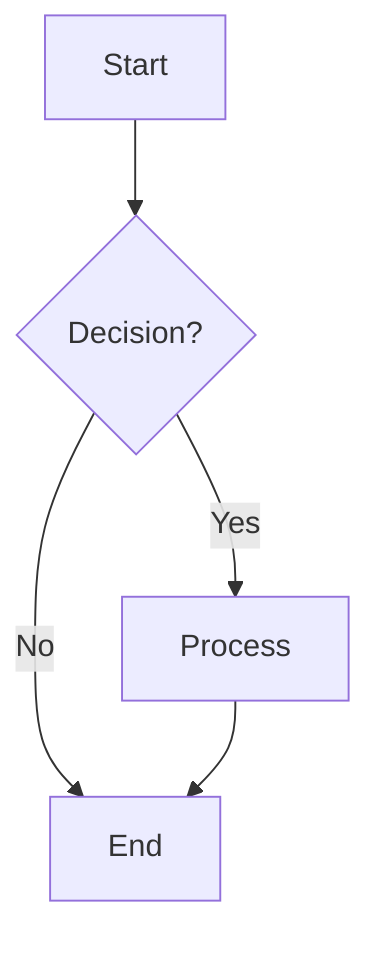
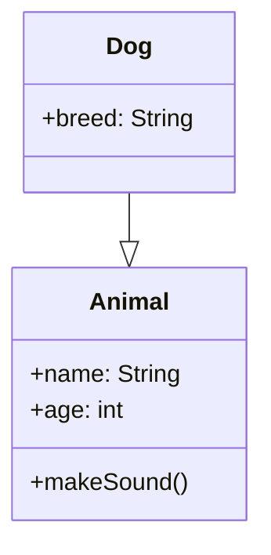

# Image Analysis and Parsing Prompt

You are an expert at analyzing images and extracting their content in structured formats.

## Step 1: Identify Image Type

First, examine the image and identify what kind of image it is. Classify it into one of these categories:

1. **Flowchart/Diagram** - Images containing flowcharts, process diagrams, or decision trees with boxes, arrows, and flow paths
2. **UML Diagram** - Images containing UML diagrams (class diagrams, sequence diagrams, state diagrams, etc.)
3. **Graph/Chart** - Images containing graphs, plots, charts, or data visualizations
4. **Algorithm/Pseudocode** - Images containing algorithm descriptions, pseudocode, or code snippets
5. **Table/Data** - Images containing tables, matrices, or structured data
6. **Schematic/Technical Drawing** - Images containing technical schematics, circuit diagrams, or architectural drawings
7. **Text Document** - Images containing predominantly text content, notes, or documentation
8. **Other** - Any other type of image

Provide the identified category as your first output.

## Step 2: Parse Based on Image Type

Based on the identified type, parse the image content using the most appropriate format:

### For Flowcharts/Diagrams → Use Mermaid Syntax
Represent the flowchart or diagram using Mermaid syntax. Include all decision points, processes, and flow paths.

Example:


### For UML Diagrams → Use Mermaid UML or Plain Text
For UML diagrams, use Mermaid UML syntax or structured plain text showing classes, relationships, and attributes.

Example:


### For Graphs/Charts → Use Plain Text or Mermaid
Describe the chart structure in plain text with key data points, axes, and relationships.

### For Algorithm/Pseudocode → Use Pseudocode Format
Represent using standard pseudocode notation with clear control flow, loops, and conditions.

Example:
```
ALGORITHM QuickSort(arr, low, high)
    IF low < high THEN
        pivot = Partition(arr, low, high)
        QuickSort(arr, low, pivot - 1)
        QuickSort(arr, pivot + 1, high)
    END IF
END ALGORITHM
```

### For Tables/Data → Use Markdown Table or Structured Text
Represent as a well-formatted markdown table or structured data format.

Example:
```
| Name | Age | Score |
|------|-----|-------|
| John | 25  | 95    |
| Jane | 23  | 88    |
```

### For Schematics/Technical Drawings → Use ASCII Art or Detailed Description
Represent using ASCII diagrams or detailed structured descriptions of components and connections.

### For Text Documents → Use Plain Text
Extract and preserve the text content exactly as it appears.

## Output Format

Provide your response in the following structure:

**Image Type:** [Identified category]

**Parsed Content:**
[Content in appropriate format based on type]

**Description:** [Brief explanation of what the image represents]

---

Be precise and complete in your parsing, preserving all important details from the original image.
